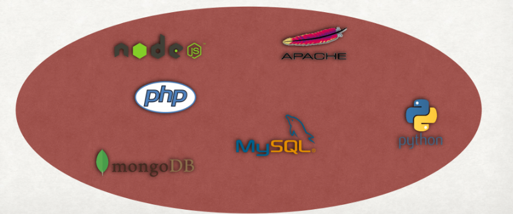

# Docker tutorial

### Prerequisite

* [Docker CE](https://docs.docker.com/engine/installation/)
* [Docker-compose](https://docs.docker.com/compose/install/)

**Note**: Docker compose might already be included within Docker CE. So after install Docker CE, you should run `docker-compose version` to check if it was installed or not.

To check if installation was success, run these command

```
docker version
docker-compose version
```

### Slide

https://www.dropbox.com/s/fh3feiht35l5xx6/docker.pptx?dl=0

### App Description

This is a simple api with express js and mongo db

Endpoints:

* `GET /`: should return "Hello world".
* `GET /list`: should return a list of item
* `GET /list/add/:name`: should add a new item to list

### Table of Content
- What is Docker?
- Basic concepts of Docker
- Running an application using Docker
- Containerize your application

### What is Docker?

#### Describe the situation

- Your Company start with a simple stack:
  - Apache + MySQL + PHP
- Several months later, your boss require to have a new stack:
  - Python tensor flow
- You need to upgrade your environment
  - From Python 2 to Python 3



#### The Problem

- Time consumming when setup a new stack
- Environment conflict between stacks (not isolated)
- Missing dependencies
